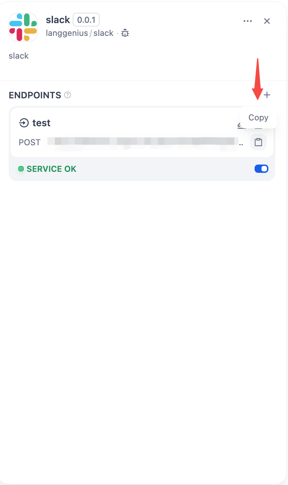
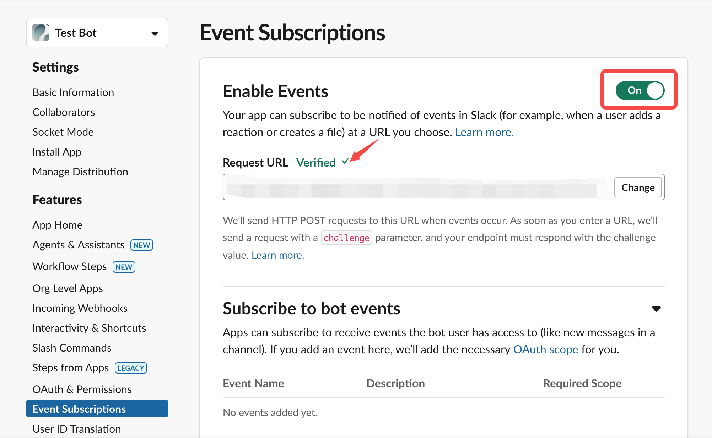
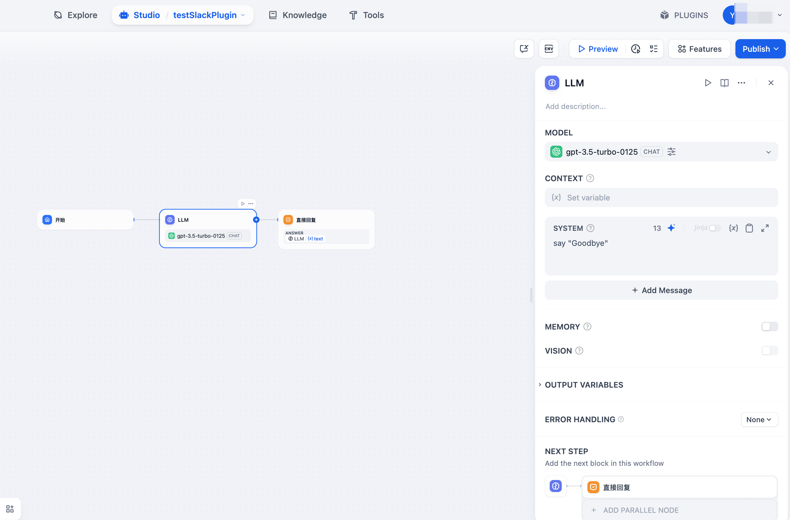

## Slack Bot with Buttons

**Author:** Langgenius  
**Version:** 1.0.0
**Type:** extension

### Description

Follow these steps to integrate the Slack plugin with button support:

1. **Create a Slack App**

   - Either create an app from a manifest or from scratch
   - Name your app and select your target workspace
     
     

2. **Configure App Settings**

   - Enable Incoming Webhooks
   - Install the app to your workspace
   - Choose a channel for message delivery
   - Locate your "Bot User OAuth Token" in settings
     
     
     

3. **Set Up Dify Endpoint**

   - Create a new endpoint with a custom name
   - Input your Bot User OAuth Token
   - Set "Allow Retry" to false (recommended to prevent duplicate messages)
   - Link to your Dify chatflow/chatbot/agent
   - Save and copy the generated endpoint URL

    <div style="display: flex; gap: 10px;">
      
      
    </div>

4. **Complete Slack App Configuration**

   - Enable Event Subscriptions
   - Paste the Dify endpoint URL as the Request URL
   - **Enable Interactivity & Shortcuts** (required for buttons)
   - **Set the same Dify endpoint URL for Request URL in Interactivity**
   - Add required OAuth scopes for Event Subscriptions
   - Configure App's OAuth & Permissions with necessary scopes
     
     

     

5. **Final Steps**
   - Reinstall the app to your workspace if you made changes
   - Add the bot to your chosen channel
   - Start interacting by @mentioning the bot in messages
     
     

### Button Feature

This bot automatically converts HTML buttons in Dify responses to Slack Block Kit buttons:

- When Dify returns HTML like `<button data-message="some text">Button Text</button>`
- The bot displays it as a clickable Slack button
- Clicking the button sends the `data-message` content back to Dify as a new query
- Supports multiple buttons in a single message

**Example:**
```
User: "I have a question"
→ Dify: "Please select: <button data-message="billing issue">Billing</button> <button data-message="technical support">Technical</button>"
→ Slack: Shows two clickable buttons
→ User: Clicks "Billing" button
→ System: Sends "billing issue" to Dify
→ Dify: Provides billing-specific response
```
